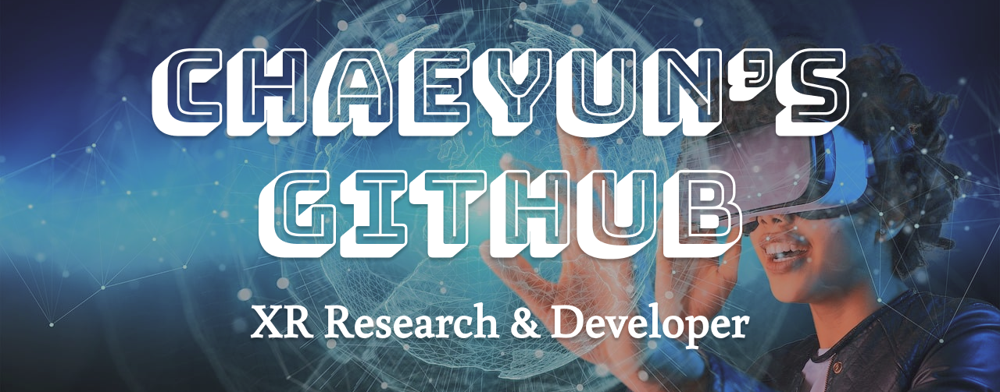

안녕하세요. XR(MR/AR) 기술에 관심이 많은 개발자 임채윤입니다.  
현재 명지대학교에 정보통신공학과 4학년으로 재학 중이고, XR 기술을 활용한 개발 및 연구를 진행 중입니다.  
XR 기술 중, 가장 좋아하는 것은 가상과 현실이 혼합되어 시너지를 낼 수 있는 MR(Mixed Reality, 혼합현실) 기술입니다.  
저의 비전은 일상생활에 XR 기술을 결합시켜, 더욱 확장성 있고 효율성 있는 삶을 만드는 것입니다.  

<h2>⚔️ Tech Stack ⚔️</h2>
        
         
       
      

## 🏅 Awards
- [ 2024. 10 ] &nbsp;**2024 메타버스 개발자 경진대회 장려상** - SMAF(Smart My AI Friend)  [[Link]](https://www.modoogallery.online/chaeso)
- [ 2024. 08 ] &nbsp;**K-MOOC 가상·증강현실분야 성적우수장학금**
- [ 2023. 06 ] &nbsp;**이공계 국가 우수 장학생**

## 🪪 Certification
- [ 2024.06 ] &nbsp;**정보처리기사**
- [ 2024.03 ] &nbsp;**초경량비행장치 무인멀티콥터조종자 1종 (드론)**
- [ 2022.09 ] &nbsp;조주기능사
- [ 2021.12 ] &nbsp;양식조리기능사
  
## 🌳 Team Project (total : 9)
- [ 2024.10 - 2024.12 ] &nbsp;**White Vision**  [[Link (Notion)]]()
  

    
자세히 보기

    <ul>
      <li><i>총 2인 중 AR 앱 총괄 개발, AI 보조</i></li>
      <li><i>Unity AR, Computer Vision AI - 저시력자 시각 보조 서비스</i></li>
      <li><i>도로 종류 별 색상 분류, 장애물 알림으로 저시력자들의 보행 안전을 돕는다</i></li>
    </ul>
  

- [ 2024.07 - 2024.09 ] &nbsp;**Smart My AI Friend (SMAF)**  [[Link (Notion)]](https://tender-octagon-f7f.notion.site/b82a79288fcb47e7929684fe32512598)
  

    
자세히 보기

    - <i>총 2인 중 XR 총괄 개발</i> 
    - <i>Unity XR, Generative AI - 혼합현실(MR) 인공지능 컴패니언</i> 
    - <i>XR·AI 기술 융합으로 일상 생활에서 자유롭게 사용 가능한 대화형 AI 콘텐츠이다.</i>
  

- [ 2024.06 - 2024.08 ] &nbsp;**Myongji Camp APP Refactoring**  [[Link (Notion)]](https://radial-primrose-72f.notion.site/HOME-4c02f484d3eb49309dd3396e129bb64a?pvs=4)
  

    
자세히 보기

    - <i>총 3인 중 APP Frontend 개발</i> 
    - <i>React Native, Spring - 프로젝트 팀원 매칭 서비스</i> 
    - <i>디자인 컨셉 변경, API 간결화, PUSH 알림, 앱 및 서버 배포 등 Refactoring을 진행한 프로젝트이다.</i>
  

- [ 2024.04 - 2024.06 ] &nbsp;**Taja Coding Web**  [[Link (Notion)]](https://languid-syringa-3ea.notion.site/fdafef44119b4b159c4423de3d458210?pvs=4)
  

    
자세히 보기

    - <i>총 4인 중 Web FullStack 개발</i> 
    - <i>React, node.js - 코딩 타자 연습 커뮤니티</i> 
    - <i>핵심 알고리즘 코드 예제를 타이핑하며 학습하거나 문제를 공유하는 커뮤니티 웹 사이트이다.</i>
  

- [ 2024.03 - 2024.06 ] &nbsp;**Feel Check APP**  [[Link (Notion)]](https://harmless-music-694.notion.site/APP-2f19aac87d77490cb344d98c512a7816?pvs=4)
  

    
자세히 보기

    - <i>총 3인 중 APP FullStack 개발</i> 
    - <i>React Native, Spring, Computer Vision AI - 표정 분석 기반 감정 일기 (캘린더)</i> 
    - <i>감정을 분석하여 기록하거나, 일기 요약과 한줄평을 제공하는 AI 감정 캘린더이다. 추가로 감정 맞춤형 서비스를 제공한다.</i>
  

- [ 2024.02 - 2024.03 ] &nbsp;**Myongji Camp APP**  [[Link (Notion)]](https://radial-primrose-72f.notion.site/HOME-4c02f484d3eb49309dd3396e129bb64a?pvs=4)
  

    
자세히 보기

    - <i>총 3인 중 APP Frontend 개발</i> 
    - <i>React Native, Spring - 프로젝트 팀원 매칭 서비스</i> 
    - <i>프로젝트를 개발하는 학생들을 위한 팀 매칭 앱이다. 해커톤에서 영감을 받아, 3주의 짧은 기간으로 완성에 도전하였다.</i>
  

- [ 2023.11 - 2023.12 ] &nbsp;**Foreigner Infra Report**  [[Link (Github)]](https://github.com/ChaeDoll/TeamProject-ForeignerReport)
  

    
자세히 보기

    - <i>총 3인 중 데이터 전처리, 그래프 시각화, 머신러닝 구현</i> 
    - <i>Jupyter Notebook, Python Library - 서울시 외국인 인프라 개선을 위한 데이터 보고서</i> 
    - <i>서울시 각 지역별 외국인 분포, 방문 목적 등을 분석하여 인프라가 부족한 위치의 새로운 인프라 구축을 제안한다.</i>
  

- [ 2023.10 - 2023.11 ] &nbsp;**Alcohol Calculator APP**  [[Link (Github)]](https://github.com/ChaeSoGong/TeamProject-AlcoholCalculator)
  

    
자세히 보기

    - <i>총 2인 중 APP Client 개발</i> 
    - <i>Kotlin, Android Studio - 알코올 도수 계산기 앱</i> 
    - <i>칵테일, 소맥 등 마시는 음료의 알코올 도수를 간단히 계산할 수 있다.</i>
  

- [ 2023.07 - 2023.09 ] &nbsp;**CockTell Project Page**  [[Link (Github)]](https://github.com/ChaeSoGong/TeamProject-Cocktell)
  

    
자세히 보기

    - <i>총 2인 중 Web FullStack 개발</i> 
    - <i>Next.js, Serverless - 칵테일 레시피 공유 커뮤니티</i> 
    - <i>칵테일 조주에 관심있는 사람들을 위한 다양하고 참신한 칵테일 레시피를 제공한다.</i>
  
 
  
## 🌱 My Project (total : 3)
- [ 2024.10 - 2024.10 ] &nbsp;**AR SMAF**
  

    
자세히 보기

    - <i>C#, Unity AR Foundation - 나만의 AR 포토카드</i> 
    - <i>증강현실 Image Tracking을 활용하여 포토카드를 인식하면 캐릭터가 나타나고, 터치로 상호작용 할 수 있다.</i>
  
 
- [ 2024.09 - 2024.09 ] &nbsp;**Duck Shooting**  [[Link (Github)]](https://github.com/ChaeDoll/XREAL-DevQuest)
  

    
자세히 보기

    - <i>C#, Unity - 오리 잡기 FPS 총 게임</i> 
    - <i>마우스와 키보드를 조작하여 제한 시간 내에 공격을 피하며 모든 오리를 처치하는 게임이다.</i>
  
 
- [ 2022.07 - 2022.07 ] &nbsp;**My Site**  [[Link (Github)]](https://github.com/ChaeDoll/ChaeDoll/tree/main/page)
  

    
자세히 보기

    - <i>HTML, CSS, Javascript - 나만의 홈페이지 My Site</i> 
    - <i>첫 프로젝트이다. 나에 대한 소개와 활동 내역, 방명록을 작성할 수 있는 사이트이다.</i>
  
 
  
## 📄 Others
 - ### Associate
   - XREAL 7기 Developer
   - 명지대학교 학부 연구생 - DAN Lab. (Data Analysis & Networking)
   - 명지대학교 정보통신공학과 학사 졸업 예정
 - ### Activities & Study
   - 스마일게이트 Orange Planet Learning Mate 3기 참가 
   - 2024 XR 디바이스 아이디어톤 본선 진출
   - 2024 환경 SW 개발 경진대회 피우다 프로젝트 참가
   - 2024 교내 SW경진대회 1차 서류 합격
   - SKT AI Fellowship 6기 1차 서류 합격
   - 2023 교내 SW경진대회 참가
   - 일본어 언어 교환 프로그램 (7주차)
   - 알고리즘 스터디 (12주차)
   - Java Spring Framework 스터디 (10주차)
 - ### TMI...🤫
   - 제 4회 전국 시각장애인 바리스타 대회 봉사 서포터즈 참가
   - 前 명지대학교 천문사진동아리 AnP 총무
   - 前 멕시칸 요리점 주방 보조
 - ### My Sites  
  &emsp;&emsp; 
  &nbsp; 
  &nbsp; 
  &nbsp; 
  &nbsp;
- ### Contact  
  📧E-mail : dlacodbs0627@gmail.com  
  🏫Student E-mail : codbs0627@mju.ac.kr
- ### MY BAEKJOON STATUS  
  

<!--여기는 아이콘 보관소
Three.js : 
Android Studio :   
Java : 
Unity : 
Kotlin : 
C# : 
Spring : 
Js : 
C :  
React : 
Next.js :  &nbsp;
WebXR :  
-->
